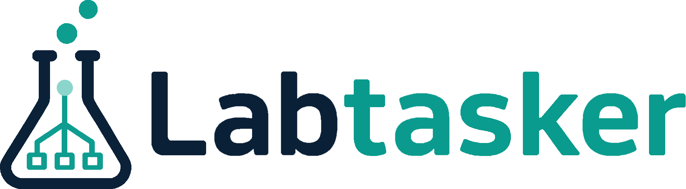
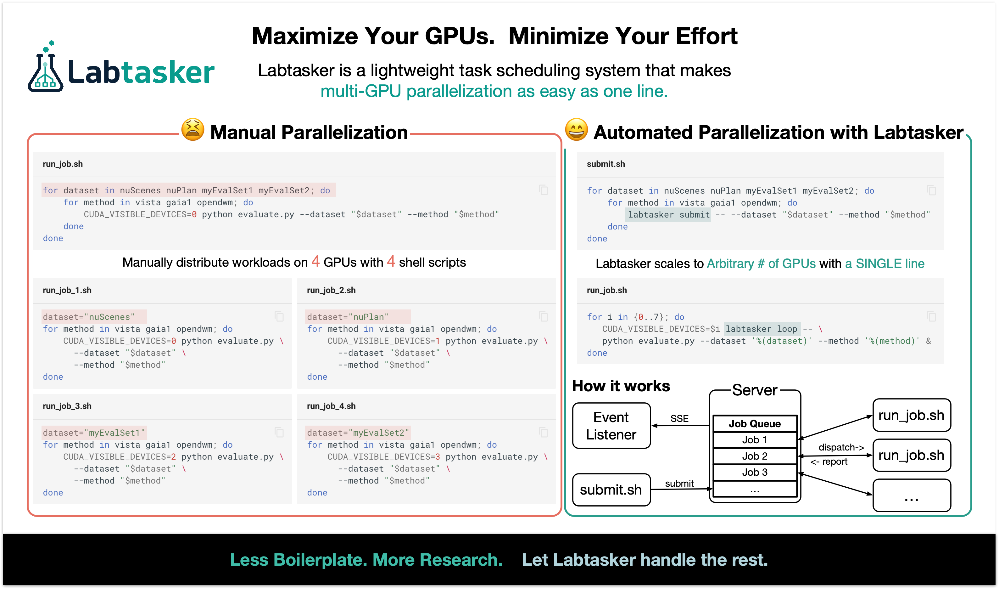
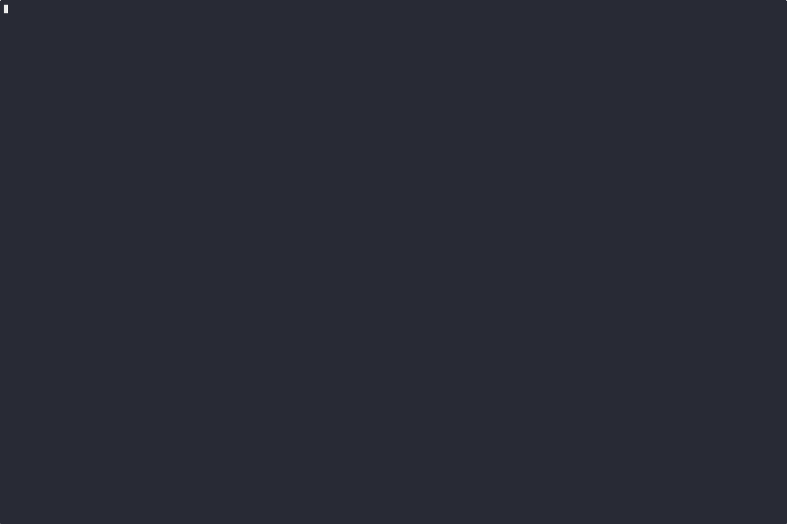

<p align="center"><em>Make your ML experiment wrapper scripts smarter with...</em></p>
<p align="center">
  
</p>
<p align="center"><a href="https://luocfprime.github.io/labtasker/latest/install/install/">Install</a> • <a href="https://luocfprime.github.io/labtasker/latest/guide/basic/">Tutorial / Demo</a> • <a href="https://luocfprime.github.io/labtasker/latest/">Documentation</a> • <a href="https://luocfprime.github.io/labtasker/latest/faq/">FAQs</a> • <a href="https://github.com/luocfprime/labtasker/releases">Releases</a></p>

<p align="center">
  
  <a href="https://codecov.io/gh/luocfprime/labtasker"></a>
  
  <a href="https://pypi.org/project/labtasker/"></a>
</p>


**<span style="font-size: 20px;"> 🌟 Labtasker makes ML experiment wrapper scripts smarter with task prioritization,
failure handling, halfway resume and more: just change 1 line of code.</span>**

If you like our project, please give us a star ⭐ on GitHub for latest update.

## ✨ When and Where to Use

**TLDR**: Replace `for` loops in your experiment *wrapper script* with labtasker to enable features like experiment
parallelization, dynamic task prioritization, failure handling, halfway resume, and more.



🐳 For detailed examples and concepts, check out the [documentation](https://luocfprime.github.io/labtasker/).

## 🧪️ A Quick Demo

This demo shows how to easily submit task arguments and run jobs in parallel.

It also features an event listener to monitor task execution in real-time and automate workflows,
such as sending emails on task failure.



For more detailed steps, please refer to the content in
the [Tutorial / Demo](https://luocfprime.github.io/labtasker/latest/guide/basic/).

## ⚡️ Features

- ⚙️ Easy configuration and setup.
- 🧩 Versatile and minimalistic design.
- 🔄 Supports both CLI and Python API for task scheduling.
- 🔌 Customizable plugin system.

## 🔮 Supercharge Your ML Experiments with Labtasker

- ⚡️ **Effortless Parallelization:** Distribute tasks across multiple GPU workers with just a few lines of code.
- 🛡️ **Intelligent Failure Management:** Automatically capture exceptions, retry failed tasks, and maintain detailed
  error logs.
- 🔄 **Seamless Recovery:** Resume failed experiments with a single command - no more scavenging through logs or
  directories.
- 🎯 **Real-time Prioritization:** Changed your mind about experiment settings? Instantly cancel, add, or reschedule
  tasks without disrupting existing ones.
- 🤖 **Workflow Automation:** Set up smart event triggers for email notifications or task workflow based on FSM
  transition events.
- 📊 **Streamlined Logging:** All stdout/stderr automatically organized in `.labtasker/logs` - zero configuration
  required.
- 🧩 **Extensible Plugin System:** Create custom command combinations or leverage community plugins to extend
  functionality.
- 🦾 **AI Agent Skills:** First-class skill definitions for [Claude Code](https://claude.ai/code) and [OpenCode](https://opencode.ai) — let your AI assistant decompose and manage experiment scripts automatically.

## 🛠️ Installation

> [!NOTE]
> You need a running Labtasker server to use the client tools.
> Simply use the installed Python CLI `labtasker-server serve` or use docker-compose to deploy the server.
> See [deployment instructions](https://luocfprime.github.io/labtasker/latest/install/deployment/).

### 1. Install via PyPI

```bash
# Install with optional bundled plugins
pip install 'labtasker[plugins]'
```

### 2. Install the Latest Version from GitHub

```bash
pip install git+https://github.com/luocfprime/labtasker.git
```

## 🚀 Quick Start

Use the following command to launch a labtasker server in the background:

```bash
labtasker-server serve &
```

Use the following command to quickly setup a labtasker queue for your project:

```bash
labtasker init
```

Then, use `labtasker submit` to submit tasks and use `labtasker loop` to run tasks across any number of workers.

> [!TIP]
> Use AI to help decompose your experiment scripts. Install the Labtasker skill for your agent:
>
> **Claude Code** — install via marketplace:
> ```
> /plugin marketplace add luocfprime/labtasker
> /plugin install labtasker-skill@labtasker
> ```
> Or copy [`skills/labtasker/SKILL.md`](skills/labtasker/SKILL.md) to `~/.claude/skills/labtasker/SKILL.md`

## 📚 Documentation

For detailed information on demo, tutorial, deployment, usage, please refer to
the [documentation](https://luocfprime.github.io/labtasker/).

## 🔒 License

See [LICENSE](LICENSE) for details.
