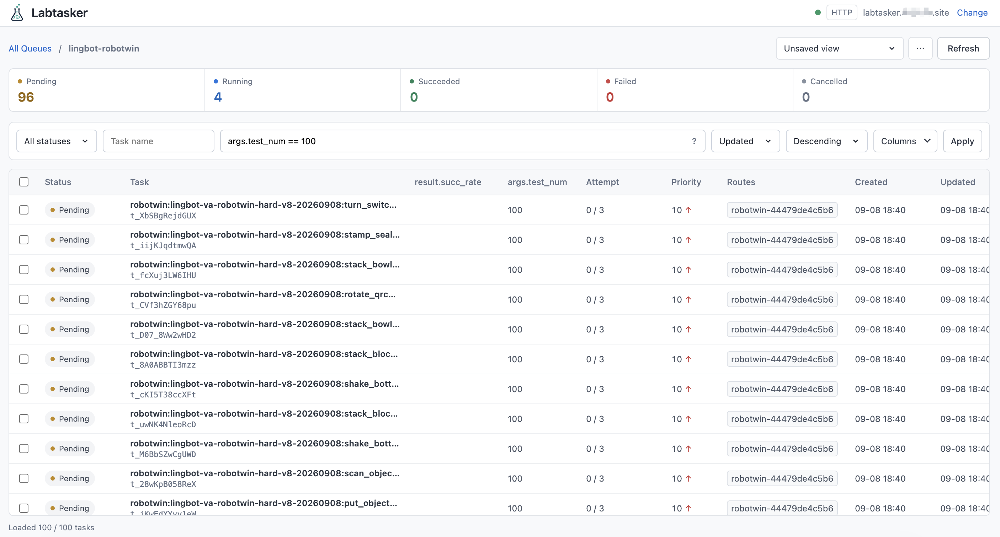

# Labtasker

<p align="center">
  
</p>

<p align="center"><em>Labtasker is a small, Python-native task queue for running independent ML inference, evaluation, and experiment jobs in parallel.</em></p>

<p align="center">
  <a href="https://github.com/luocfprime/labtasker/actions/workflows/ci.yml"></a>
  <a href="https://github.com/luocfprime/labtasker/actions/workflows/docs.yml"></a>
  <a href="https://pypi.org/project/labtasker/"></a>
  
</p>

---

**Documentation:** <https://luocfprime.github.io/labtasker/>

**LLM Documentation:** <https://luocfprime.github.io/labtasker/latest/llms.txt>

**Source Code:** <https://github.com/luocfprime/labtasker>

---

Labtasker distributes independent ML jobs across multiple processes and
machines. It adds dynamic control, failure recovery, and structured Task
records without requiring each project to build its own task system.

The key features are:

- **Effortless and flexible parallelism:** Run the same Task queue with multiple
  Workers. Submit new Tasks, change priorities, or cancel Tasks without
  interrupting the Workers.
- **Resumable and failure-resistant experiments:** Retry failed Tasks
  automatically and recover work when a Worker stops. Restart Workers without
  rerunning completed Tasks. These lifecycle behaviors are covered by unit and
  end-to-end tests.
- **Structured task records:** Keep each Task's arguments, metadata, status,
  errors, and structured result in one place for inspection.
- **Easy to adopt and use:** Add Labtasker to existing Python code in fewer than
  10 lines, or wrap an existing command with no code changes. The API,
  non-interactive CLI, [Agent Skill](docs/guides/agent-skill.md), and
  [agent-readable documentation](docs/llms.txt) allow an agent to operate
  Labtasker end to end.

## See Labtasker in action

This visual overview shows Workers sharing a Queue, failed Tasks returning for
another attempt, live experiment changes, structured results, and agent-driven
operation.

<video src="https://github.com/user-attachments/assets/152e54dd-734d-479d-b961-5ba428da551c" width="100%" controls playsinline></video>

> [!TIP]
> **Hand Labtasker operations over to your coding agent.** Install the bundled
> [Agent Skill](docs/guides/agent-skill.md), then let your agent handle the
> Labtasker workflow end to end through its documented interfaces. You only
> need to tell your agent which Tasks to run and how they should run in
> parallel.

## Installation

Labtasker requires Python 3.10 or newer. Install the complete package for local use:

```bash
python -m pip install labtasker
```

Or add it to a `uv` project:

```bash
uv add labtasker
```

The `labtasker` package installs matching Client and Server releases. A remote
Worker environment can install only the lightweight Client, avoiding the Server
dependency tree:

```bash
python -m pip install labtasker-client
```

You can also install `labtasker-server` separately when the Server runs in its
own environment.

## Example

Suppose an existing evaluation program accepts a checkpoint, benchmark task,
and seed:

```bash
python evaluate.py \
  --checkpoint checkpoints/model.pt \
  --task pick-cube \
  --seed 0
```

Submit each evaluation case as a Labtasker Task:

```bash
labtasker task submit \
  --name pick-cube-seed-0 \
  --args '{"checkpoint":"checkpoints/model.pt","task":"pick-cube","seed":0}' \
  --route robotwin
```

Then run the existing program through a command Worker:

```bash
labtasker loop --route robotwin -- \
  python evaluate.py \
    --checkpoint '%{checkpoint}' \
    --task '%{task}' \
    --seed '%{seed}'
```

Start one Worker process on each GPU you want to use. All Workers claim from the
same Queue and process one Task at a time. The route name `robotwin` labels which
Worker implementation can run the submitted Task.

To save evaluation metrics as the Task result, report them from the evaluation
program:

```python
import labtasker

# TODO: Replace this with metrics from your actual evaluator.
# Replace the latest dashboard snapshot without completing the Task.
labtasker.report_progress({"completed": completed_cases, "total": total_cases, "metrics": metrics})

labtasker.finish(metrics, skip_if_no_labtasker=True)
```

`progress` is a replace-only JSON object for current metrics and external
early-stop decisions. It is retained when a run is cancelled, while `result`
remains the final successful output. Full metric history and artifacts stay in
the experiment's existing tracking or storage system. Labtasker does not
restrict the object's keys. `completed` and `total` are the optional display
convention used by Labtasker WebUI for a determinate progress indicator.

Inspect progress and results at any time:

```bash
labtasker task list
labtasker task list --status succeeded
labtasker task list --status failed
```

Follow [Run your first experiment](docs/getting-started.md) for a complete
tutorial with copyable code and expected results. Use a
[Python Worker](docs/workers/python.md) when a model should remain loaded while
the Worker processes multiple Tasks.

## When to use Labtasker

Labtasker is designed for independent ML jobs such as:

- model inference over prompts, samples, or dataset shards;
- evaluation across checkpoints, benchmark cases, and random seeds;
- generation and ablation experiments across parameter combinations;
- independent data-processing or analysis jobs.

Labtasker becomes useful when several processes share the work, you need to
resume after an interruption without rerunning completed jobs, or you need to
add, cancel, or reprioritize jobs during a run.

## When NOT to use Labtasker

- A simple loop can be sufficient for a small experiment with a few short jobs
  that can be rerun in full.
- Use a workflow or DAG system when jobs depend on outputs from earlier jobs.
- Use a cluster or resource scheduler when you need to allocate GPUs, start
  machines, or manage compute capacity.
- Use an artifact store for model checkpoints, generated media, and other large
  outputs. Labtasker records their paths or URLs, not the files themselves.

Labtasker is deliberately designed to be conceptually simple and easy to hand
over to agents.

## Documentation

- [Documentation overview](docs/index.md): choose the right tutorial, guide, or
  reference page.
- [Run your first experiment](docs/getting-started.md): submit several cases and
  process them through one Queue.
- [Why Labtasker?](docs/why-labtasker.md): decide whether Labtasker fits your
  experiment workflow.
- [How Labtasker works](docs/concepts.md): understand Tasks, Workers, routes,
  Queues, retries, and recovery.
- [Inference and evaluation patterns](docs/inference-evaluation.md): adapt
  Labtasker to common ML workloads.
- [Command Workers](docs/workers/command.md) and
  [Python Workers](docs/workers/python.md): choose how Tasks run.
- [CLI reference](docs/reference/cli.md) and
  [Python API reference](docs/reference/python-api.md): check exact interfaces.
- [Specification](docs/reference/specification.md): read the authoritative
  product and protocol contract.

Labtasker also includes an [Agent Skill](docs/guides/agent-skill.md) that helps
compatible coding agents submit Tasks, design Workers, inspect progress, and
recover failed work through the documented interfaces.

## Web UI

[Labtasker WebUI](https://github.com/luocfprime/labtasker-webui) is a separately
installed browser interface for Labtasker v2. Track Queue progress, filter Tasks,
compare result fields in custom columns, and save views for each experiment.

[](https://github.com/luocfprime/labtasker-webui)

```bash
uvx labtasker-webui
```

Open <http://127.0.0.1:8080> and connect to an existing HTTP Server or a running
local project. See [Use the Web UI](docs/guides/webui.md) for connection steps
and Task controls.

## Development

```bash
uv sync --all-packages --group dev --frozen
uv run pytest
uv run zensical build --clean
```

See [Development](docs/development.md) for repository boundaries and the full
validation commands.

## License

Apache-2.0.
