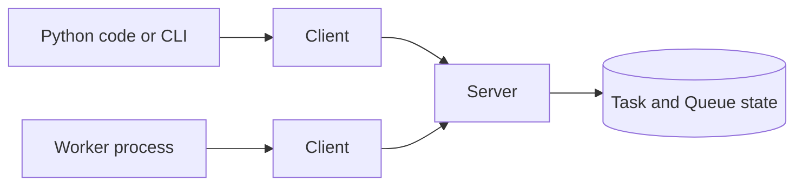
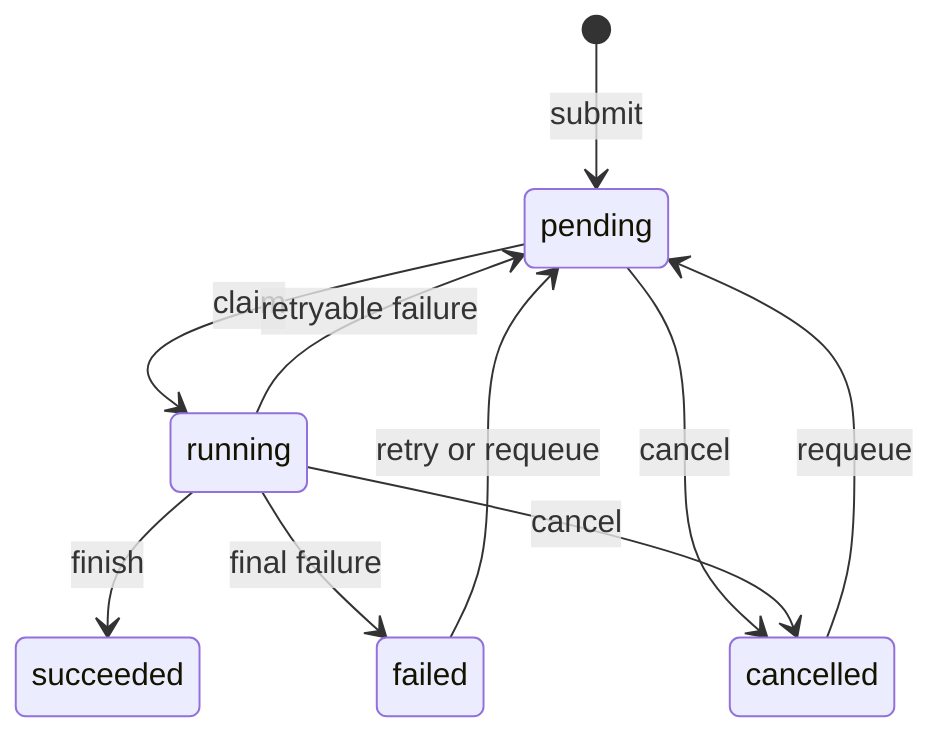

# How Labtasker works

Labtasker coordinates independent ML jobs through a small Client and Server
model. You submit each job as a Task, then start Workers on resources you
already control. Each Worker claims one compatible Task, runs it, reports the
outcome, and asks for another.

## The complete model



The Server stores Task state and coordinates claims. It does not start Workers,
allocate GPUs, track machine capacity, or store large model outputs.

| Concept | Meaning |
| --- | --- |
| Task | One independent job and its recorded state |
| Worker | One process that runs at most one Task at a time |
| route | An exact label that matches Tasks with compatible Worker code |
| Queue | A collection of Tasks managed and scheduled together |
| Client | The Python or CLI interface to one Server and Queue |
| Server | The process that stores Tasks and coordinates their execution |

## Tasks record work and outcomes

A **Task** contains the inputs for one job and the state Labtasker records for
it. This includes JSON arguments, optional metadata, priority, compatible
routes, retry settings, result data, timestamps, and the latest error.

The usual path is:



Labtasker uses named actions instead of letting callers set `status` directly:

- cancel a pending or running Task;
- retry a failed Task using its remaining attempt budget;
- requeue a pending, failed, or cancelled Task with a fresh attempt budget;
- update or delete a Task while it is not running.

A succeeded Task cannot be changed back into a pending Task. Submit a new Task
when you want to run the same experiment case again.

## Workers run one Task at a time

A **Worker** is a Client process that runs at most one Task at a time. Start one
Worker on each CPU, GPU, machine, or other resource you want to use. When a
Worker finishes a Task, it asks the Server for another.

Choose a Worker form based on how your experiment runs:

- [Python Workers](workers/python.md) integrate with Python code and can keep a
  model loaded across Tasks.
- [Command Workers](workers/command.md) run an existing command for each Task.
- [Distributed launchers](workers/distributed.md) run one Task through a
  supported multi-process launcher.

The Server does not track Worker processes or their hardware. You start, stop,
and supervise the Workers.

## Routes match Tasks with Worker code

A **route** is an exact, case-sensitive compatibility label. Every Worker uses
one route. Every Task lists one or more routes. A Worker can claim a Task only
when its route appears in that list.

```text
Task routes:  ["sdxl-diffusers-v1", "sdxl-diffusers-v2"]
Worker route: "sdxl-diffusers-v2"
Claim:        allowed
```

Choose a route that identifies the workload or implementation the Worker can
run, such as `robotwin`, `libero`, or `sdxl-diffusers-v2`. Labtasker never
guesses compatibility from Task arguments.

Routes also make implementation changes explicit. Start the new implementation
under a new route, then add that route only to pending Tasks it can run. Starting
the Worker alone does not redirect existing work.

## Queues group related Tasks

A **Queue** contains a set of Tasks that are managed and scheduled together.
Every Client operation selects one Queue, and Task IDs are unique within that
Queue. A new Server contains Queue `default`.

Create another Queue when two groups of Tasks need separate inspection,
priorities, and lifecycle operations. Do not use Queues to describe hardware or
Worker compatibility. Use routes for that purpose.

## Run IDs reject results from old runs

When a Worker claims a Task, the Task becomes `running` and the Server creates a
private `run_id` for that execution. Heartbeats and outcome reports must use the
same ID.

If a Worker loses contact and another Worker later claims the Task, the new run
gets a new ID. A delayed result from the old Worker no longer matches and cannot
overwrite the current result.

## Leases recover Tasks when Workers stop responding

A Worker renews its running Task's five-minute lease once per minute. If the
heartbeats stop, the Server returns the Task to `pending` or marks it `failed`,
depending on its remaining attempt budget.

The lease detects a Worker that stopped responding. It is not a time limit for
the experiment code. A Task can run longer than five minutes as long as its
Worker keeps sending heartbeats.

## Attempts control retries

`attempt` counts executions charged against `max_attempts`.

| Outcome | Effect |
| --- | --- |
| Ordinary exception or `TaskError` | Charge the current execution, then retry or fail according to the remaining budget |
| `TransientError` | Return the Task to `pending` without charging that incident |
| Retry action | Move a failed Task to `pending` without resetting `attempt` |
| Requeue action | Move a pending, failed, or cancelled Task to `pending` and reset `attempt` |

Read [Failure and recovery](guides/failure-recovery.md) for recovery procedures.
The [specification](reference/specification.md) defines the exact lifecycle and
protocol rules.
