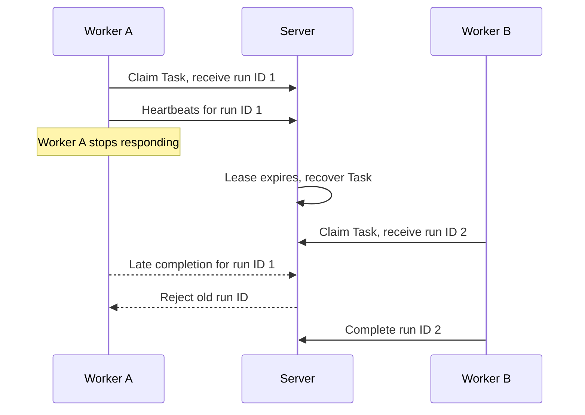

# Failure and recovery

Labtasker records what finished and returns retryable work to the Queue, so a
Worker crash or interrupted session does not require rerunning the complete
experiment. A **charged failure** consumes one of the Task's `max_attempts`; an
uncharged incident leaves that retry budget unchanged.

## Failure behavior

For Python Workers:

| Outcome | Task effect | Worker effect |
| --- | --- | --- |
| normal return or `finish()` | succeeded | continues |
| ordinary exception or `TaskError` | charged failure | continues |
| `TransientError` | pending, incident uncharged | continues |
| `FatalWorkerError` | charged failure | exits |
| `KeyboardInterrupt` | tries to return the Task to pending | exits |

For command Workers that have not called `finish()`, exit code zero succeeds and
a non-zero exit code is a charged failure. After the Server accepts `finish()`,
a later exception or non-zero child exit does not change the succeeded Task. A
charged failure returns to pending while retry budget remains; otherwise the
Task becomes failed.

## Heartbeat recovery

Every claim receives a private run ID and a five-minute lease. The Worker sends a
heartbeat once per minute. Transport failures are retried. If heartbeats stop,
the Server returns the Task to `pending` or marks it `failed`, depending on the
remaining retry budget.



The run ID identifies the current execution. After another Worker claims the
recovered Task, a late heartbeat or result from the old Worker is rejected and
cannot change the new run.

There is no separate execution timeout. A Task can run longer than five minutes
as long as its Worker keeps sending heartbeats.

## Cancellation

The Server records the cancellation immediately. Local execution may take time
to stop:

- Python code can poll `cancellation_requested()`.
- Command Workers send termination to the child process group; a configured
  force-stop timeout kills child processes that are still running.
- `force_stop_timeout=None`, the default, lets child processes finish cleanup
  without a time limit.

This default protects codebases that have already produced a result but cannot
reliably tear down complex engines on demand.

## Local run journal

Each Task run creates a directory under:

```text
.labtasker/runs/{queue}/{task-name-slug}__{task_id}/
  {started-at}__attempt-{attempt}__{run_id}/
```

It records the claimed Task, run state, combined output log, and completion or
failure data prepared for the Server. Once completion or failure data is
written, the journal does not change it. If the Server accepts a result but a
later journal write fails, the Task remains succeeded.

The Server's Task state is the source of truth. The journal is for local
browsing and debugging; v2 does not restore Server state from it.

## Diagnostics

A Task retains only its latest charged error: type, message, traceback when
available, timestamp, attempt, and run ID. A later success does not erase that
diagnostic; manual requeue does. `started_at` and `finished_at` describe the
latest run and provide an approximate runtime. Labtasker does not store a
separate history of every run.
