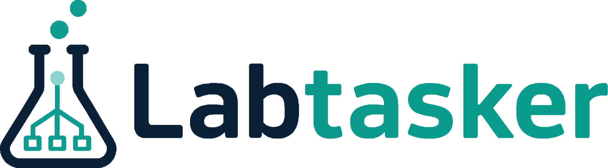

# Labtasker

  

**Run many independent ML experiments in parallel without writing and debugging
your own task distribution, retry, and result-collection scripts.**

If you only have a few jobs and can safely rerun everything, a simple script may
be all you need. Now suppose you have 100 evaluations and 8 GPUs. How do you keep
every GPU busy when some evaluations take much longer than others? What happens
when one fails halfway, the run is interrupted, or a new high-priority case
arrives?

Most projects gradually add GPU-assignment logic, status files, retries, locks,
and result parsing to answer those questions. Even if an agent writes the code,
you still have to explain those requirements and debug another project-specific
task system.

Compared with one-off task scripts, Labtasker provides a cleaner, better-tested,
and more reliable solution with less project-specific code. Its standardized,
explicit workflow is easy to automate and agent-friendly by design. With the
bundled Agent Skill, task dispatch can be as simple as telling your agent: “Run
these jobs in parallel across 8 GPUs with Labtasker.”

| Without Labtasker :cry: | With Labtasker :smiley: |
| --- | --- |
| **Assign jobs to GPUs before starting.** This works while runtimes are predictable; otherwise some GPUs finish early and sit idle. | **Jobs are picked up as GPUs become free.** Work stays balanced even when runtimes vary. |
| **Use logs and output files to remember progress.** This works while every run finishes cleanly; after an interruption, it becomes unclear what is safe to rerun. | **Labtasker remembers what finished.** Restart and continue the unfinished jobs without repeating completed work. |
| **Ask an agent to add retries, locks, and failure rules.** This one-off code is rarely tested thoroughly, so subtle bugs may appear only after a large experiment is underway. | **Use built-in retry and recovery behavior.** The same tested implementation is reused across experiments, and an old process cannot overwrite a newer result. |
| **Parse logs and directories to collect results.** Every project develops another output format and collection script. | **Report every job in a consistent format.** Agents and automation can inspect results directly, while large files remain in project-owned storage. |
| **Rewrite or restart scripts when the plan changes.** Adding urgent jobs or cancelling unnecessary ones can disturb unrelated work. | **Change the plan while the experiment is running.** Add, cancel, or prioritize jobs without stopping unrelated work. |
| **Hide program compatibility in arguments and launcher conditions.** After an implementation changes, it is hard to tell which version should run which job. | **Label compatible implementations explicitly.** Old and new versions can run side by side without silently redirecting existing jobs. |
| **Reload an expensive model for every case, or build another custom loop.** The first option wastes startup time; the second adds more coordination code. | **Keep expensive state loaded across many jobs.** Each process can reuse its model or evaluator while Labtasker supplies new inputs. |
| **Explain scheduling and recovery behavior to an agent for every project.** The agent ends up inventing and debugging another task system. | **Tell the agent to use Labtasker.** The bundled skill supplies the same tested workflow for submission, execution, inspection, and recovery. |

## Where it fits

- **AIGC and ablations:** run many prompts, seeds, checkpoints, or ablation cases
  across available GPUs, then inspect and prioritize the useful results.
- **Embodied-AI benchmarks:** dispatch suites and subtasks whose runtimes are hard
  to predict without leaving GPUs idle behind a slow, fixed shard. The
  [Embodied AI: RoboTwin evaluation (StarVLA codebase)](case-studies/starvla-robotwin.md)
  case study shows this in a real 50-task VLA evaluation workflow.
- **Inference, evaluation, and data processing:** coordinate any collection of
  independent, parameterized work on user-started Workers.

Labtasker schedules work; it does not allocate GPUs, manage a cluster, build a
workflow DAG, or store large artifacts. Read [Why Labtasker?](why-labtasker.md)
for the full motivation, product boundary, and the design changes from v1 to v2.

## The v2 approach

V2 favors one obvious way to perform each operation. Task compatibility is
declared with explicit routes instead of inferred from arguments, lifecycle
changes are named actions, and stale Worker runs are fenced from newer attempts.
The default Python installation manages a local SQLite Server automatically, so
MongoDB, Mongomock, port setup, and configuration are unnecessary for ordinary
local use.

The same explicit design makes Labtasker suitable for agents: it includes an
Agent Skill, uses deterministic non-interactive commands, and avoids asking an
agent to guess hidden state. See [From v1 to v2](why-labtasker.md#from-v1-to-v2)
for the design rationale.

## Choose a starting point

- [Get started](getting-started.md) uses the default local Server, submits a Task,
  and executes it.
- [Why Labtasker?](why-labtasker.md) explains the problem, target workflows,
  product boundary, and v2 redesign.
- [Core model](concepts.md) explains queues, routes, attempts, and run fencing.
- [Inference and evaluation](inference-evaluation.md) shows warm model reuse,
  evaluator dispatch, implementation rollouts, and artifact handling.
- [Python Workers](workers/python.md) bind typed Task arguments to a function.
- [Command Workers](workers/command.md) bind Task arguments to an argv template.
- [Task operations](guides/tasks.md) covers submission, inspection, updates, and
  lifecycle actions.
- [Agent skill](guides/agent-skill.md) installs the same Labtasker workflow for
  Claude Code, Codex, and other Agent Skills-compatible tools.
- [llms.txt](llms.txt) gives agents a concise, standard entry point to the raw
  Markdown guides and references.
- [HTTP API](reference/http-api.md) points agents and integrations to the live
  machine-readable contract.

The standalone [v2 specification](reference/specification.md) is authoritative
when this guide omits protocol detail.
